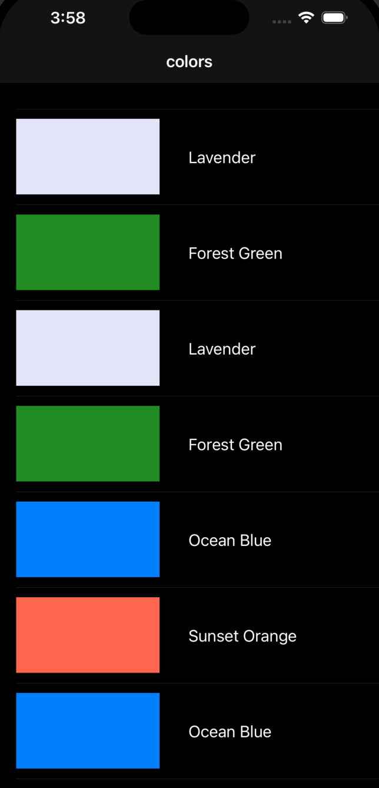

# 🎨 OneClick Colors

OneClick Colors is a simple iOS app to browse a neat list of colors by name.  
Tap any color to instantly preview it full-screen with vibrant clarity.  
Perfect for designers, artists, or anyone who loves exploring colors easily on the go.

## ✨ Features
- Browse a list of named colors.
- Tap a color to preview full screen.
- Minimal and lightweight design.
- Smooth navigation and fast performance.

## 📸 Screenshots
| Color List | Full Screen Preview |
|------------|--------------------|
|  |  

🚀 Installation
Clone the Repository
git clone https://github.com/your-username/OneClick-Colors.git
cd OneClick-Colors
Open in Xcode
Double-click the .xcodeproj or .xcworkspace file.
Make sure you have the latest version of Xcode installed.
Run the App
Select your target device or simulator in Xcode.
Click the ▶ Run button.

🛠 Requirements
iOS: 15.0 or later
Xcode: 14.0+
Swift: 5.7+

🤝 Contributing
Fork the repository
Create a new branch (git checkout -b feature-name)
Commit your changes (git commit -m "Add some feature")
Push to the branch (git push origin feature-name)
Open a Pull Request

📄 License
This project is licensed under the MIT License — see the LICENSE file for details.

